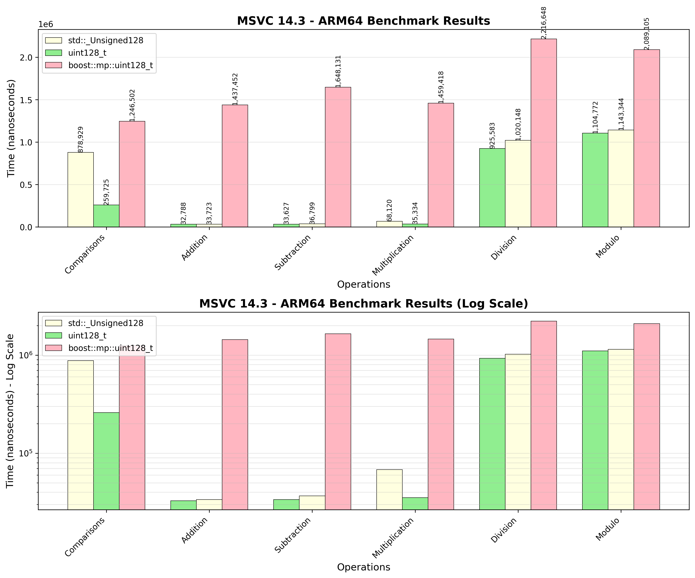
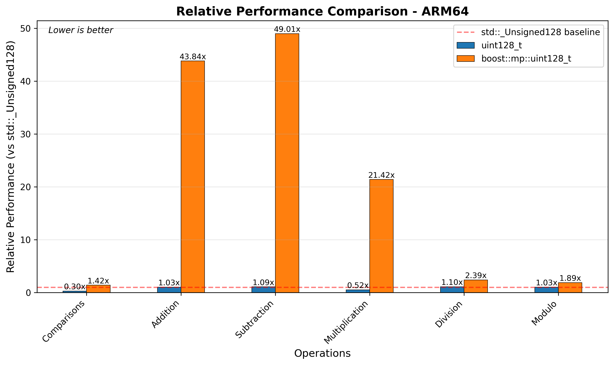
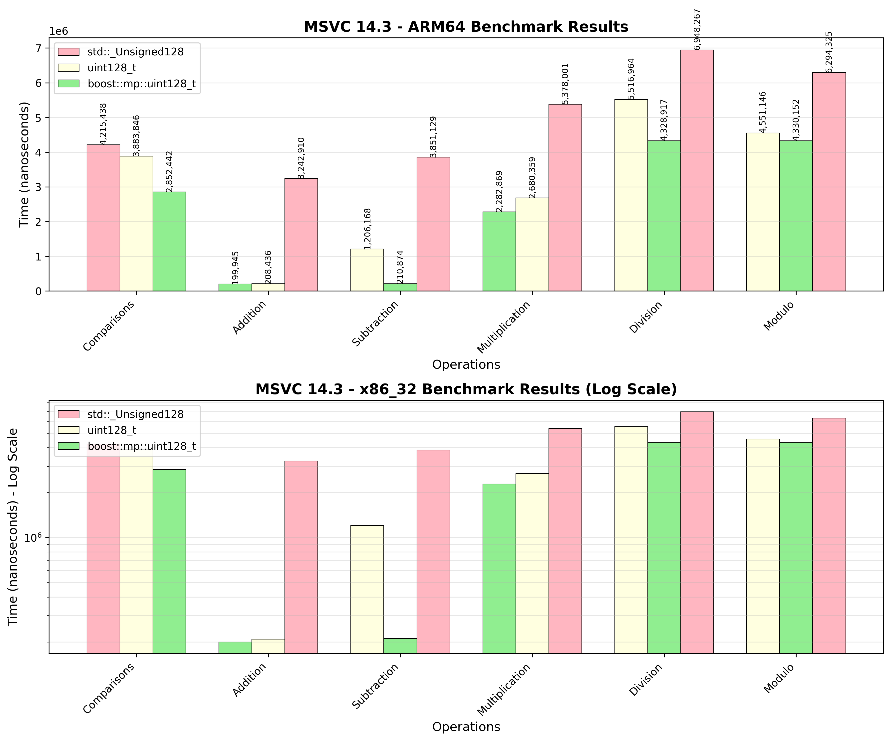
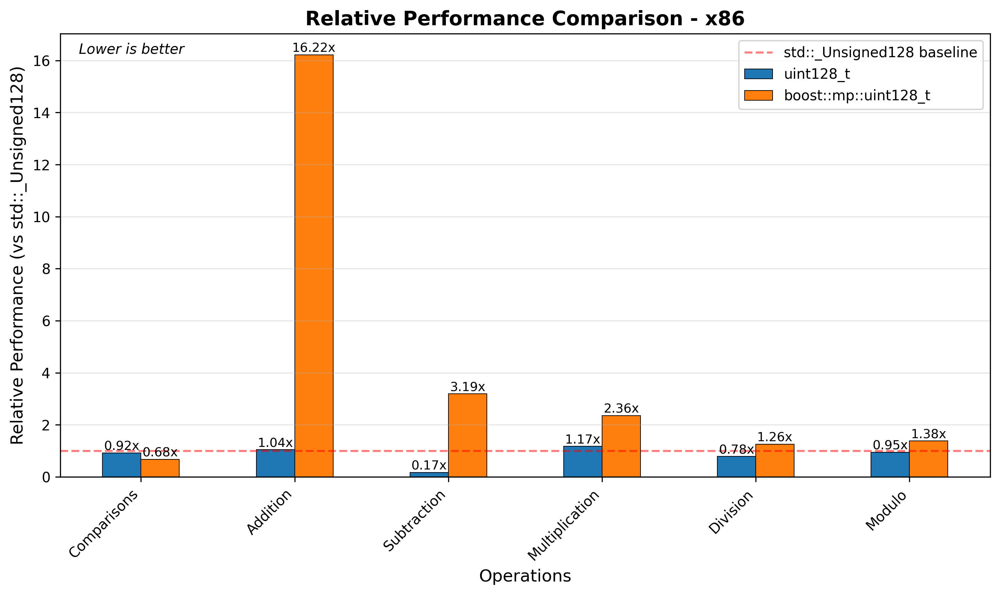
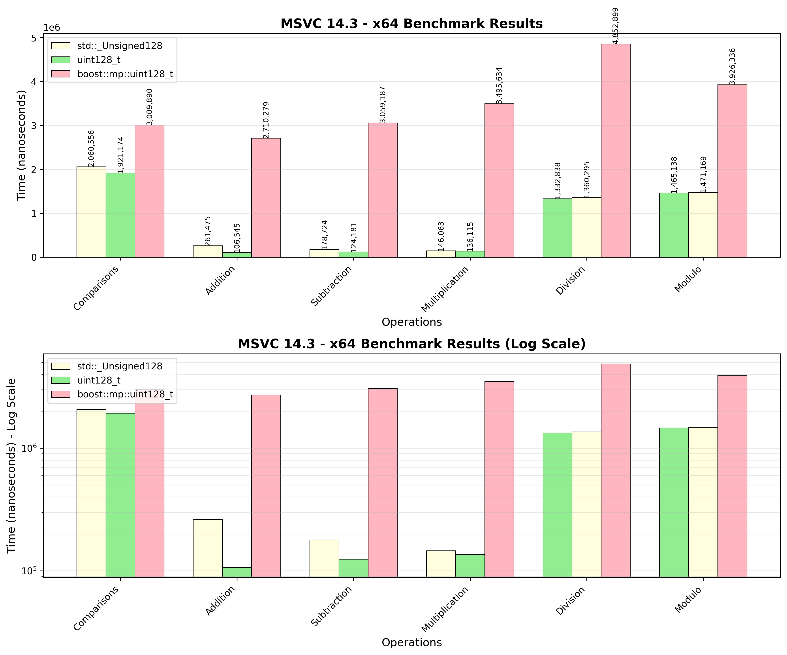
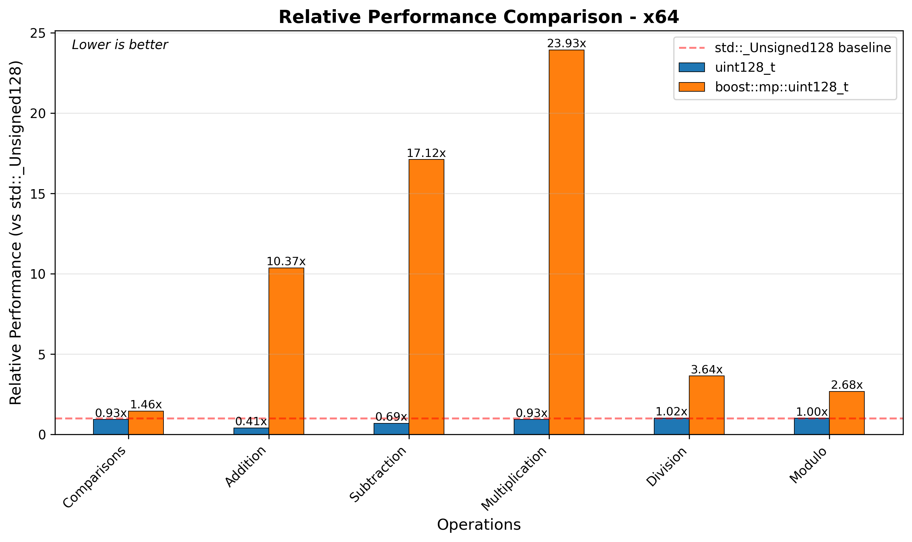
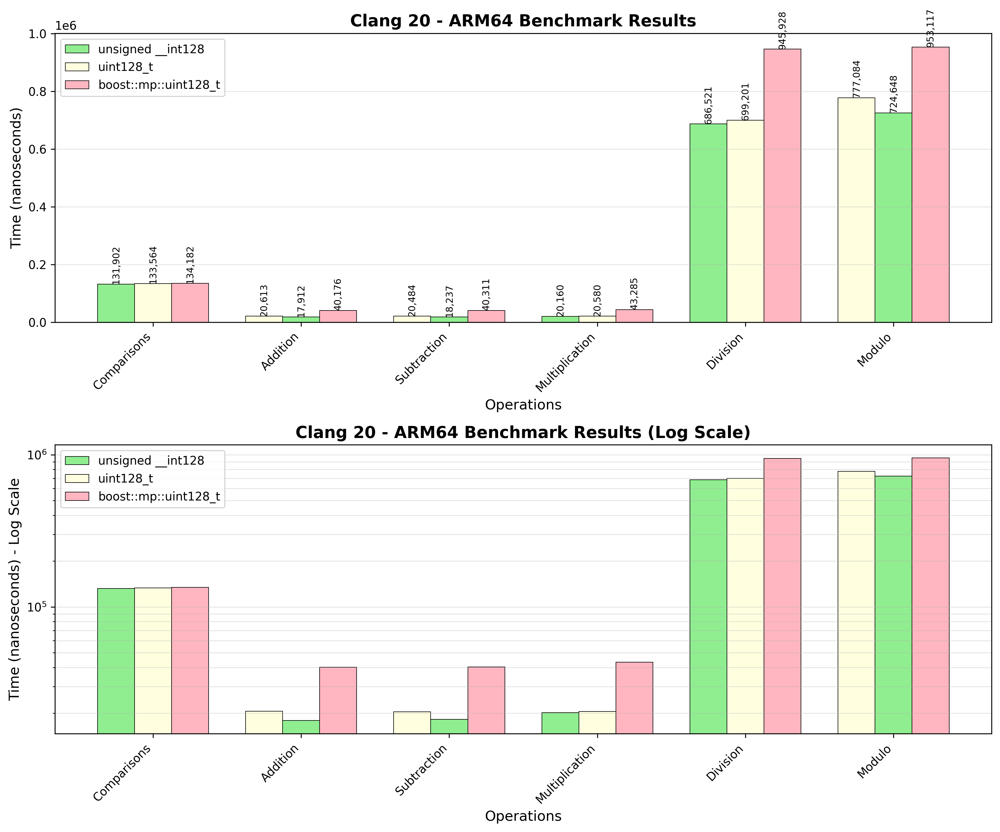
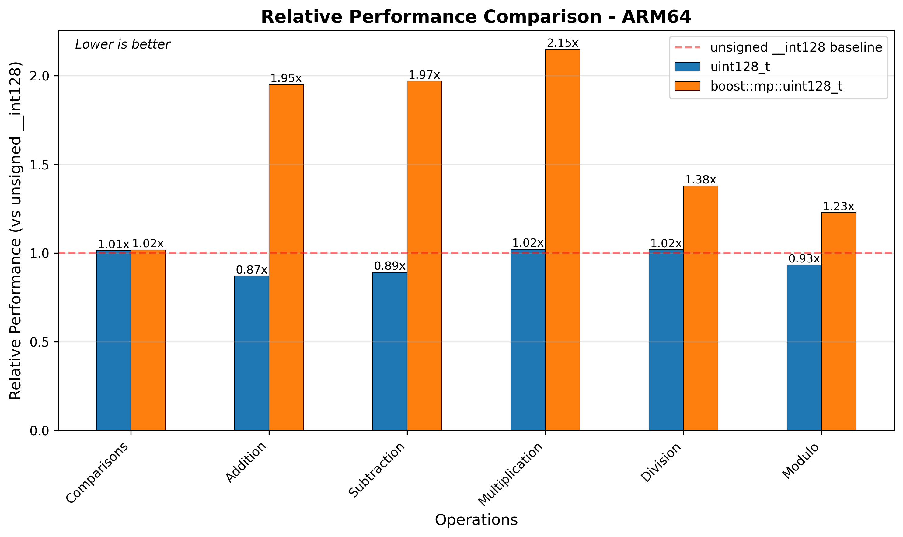
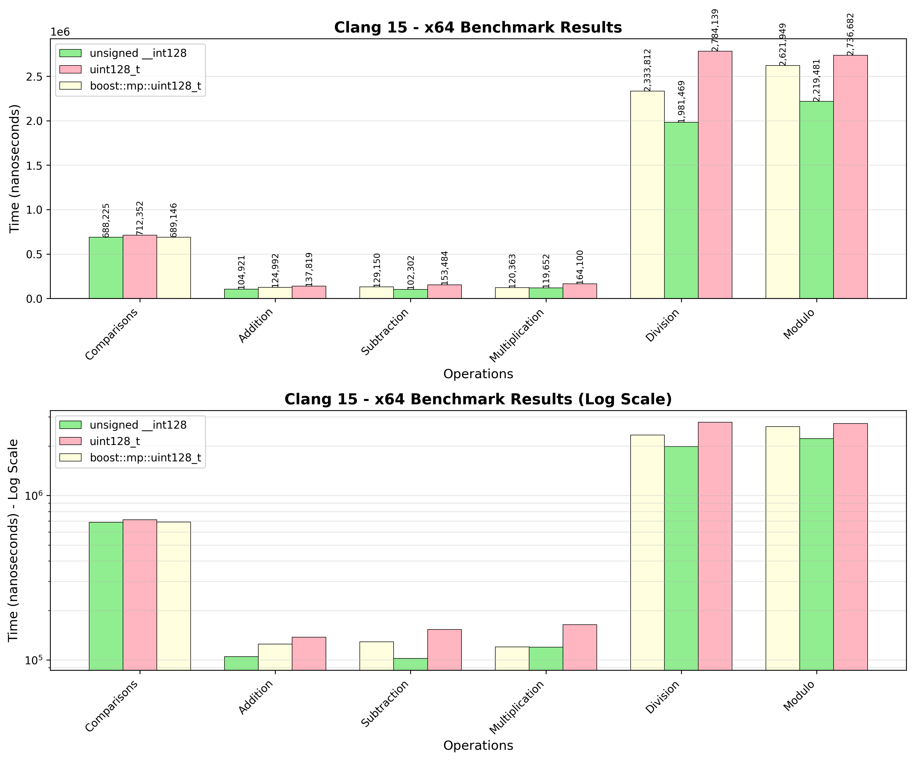
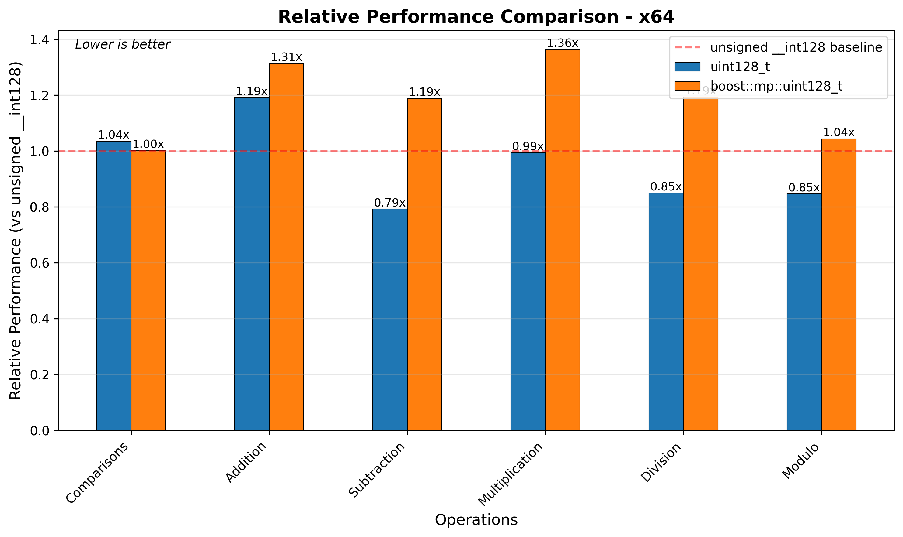

////
Copyright 2025 Matt Borland
Distributed under the Boost Software License, Version 1.0.
https://www.boost.org/LICENSE_1_0.txt
////

[#u128_benchmarks]
= `uint128_t` Benchmarks
:idprefix: u128_benchmarks_

== Linux

=== x86_64

=== x86_32

=== ARM64

=== ARM32

=== S390x

== Windows

=== ARM64

[cols="1,1,1,1"]
|===
| Operation | `std::_Unsigned128` | `uint128_t` | `boost::mp::uint128_t`

| Comparisons | 878929 | 259725 | 1246502
| Addition | 32788 | 33723 | 1437452
| Subtraction | 33627 | 36799 | 1648131
| Multiplication | 68120 | 35334 | 1459418
| Division | 925583 | 1020148 | 2216648
| Modulo | 1104772 | 1143344 | 2089105
|===

=== x86_32

[cols="1,1,1,1"]
|===
| Operation | `std::_Unsigned128` | `uint128_t` | `boost::mp::uint128_t`

| Comparisons | 4215438 | 3883846 | 2852442
| Addition | 199945 | 208436 | 3242910
| Subtraction | 1206168 | 210874 | 3851129
| Multiplication | 2282869 | 2680359 | 5378001
| Division | 5516964 | 4328917 | 6948267
| Modulo | 4551146 | 4330152 | 6294325
|===

=== x86_64

[cols="1,1,1,1"]
|===
| Operation | `std::_Unsigned128` | `uint128_t` | `boost::mp::uint128_t`

| Comparisons | 2060556 | 1921174 | 3009890
| Addition | 261475 | 106545 | 2710279
| Subtraction | 178724 | 124181 | 3059187
| Multiplication | 146063 | 136115 | 3495634
| Division | 1332838 | 1360295 | 4852899
| Modulo | 1465138 | 1471169 | 3926336
|===

== macOS

=== ARM64 (Apple Silicon)

[cols="1,1,1,1"]
|===
| Operation | `unsigned __in128` | `uint128_t` | `boost::mp::uint128_t`

| Comparisons | 131902 | 133564 | 134182
| Addition | 20613 | 17912 | 40176
| Subtraction | 20484 | 18237 | 40311
| Multiplication | 20160 | 20580 | 43285
| Division | 686521 | 699201 | 945928
| Modulo | 777084 | 724648 | 953117
|===

=== x86_64

[cols="1,1,1,1"]
|===
| Operation | `unsigned __in128` | `uint128_t` | `boost::mp::uint128_t`

| Comparisons | 131902 | 133564 | 134182
| Addition | 20613 | 17912 | 40176
| Subtraction | 20484 | 18237 | 40311
| Multiplication | 20160 | 20580 | 43285
| Division | 686521 | 699201 | 945928
| Modulo | 777084 | 724648 | 953117
|===

