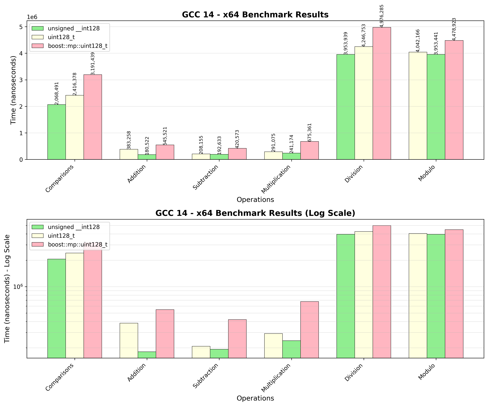
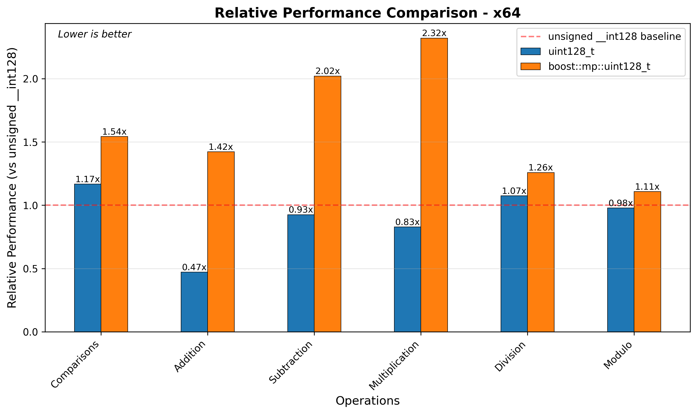
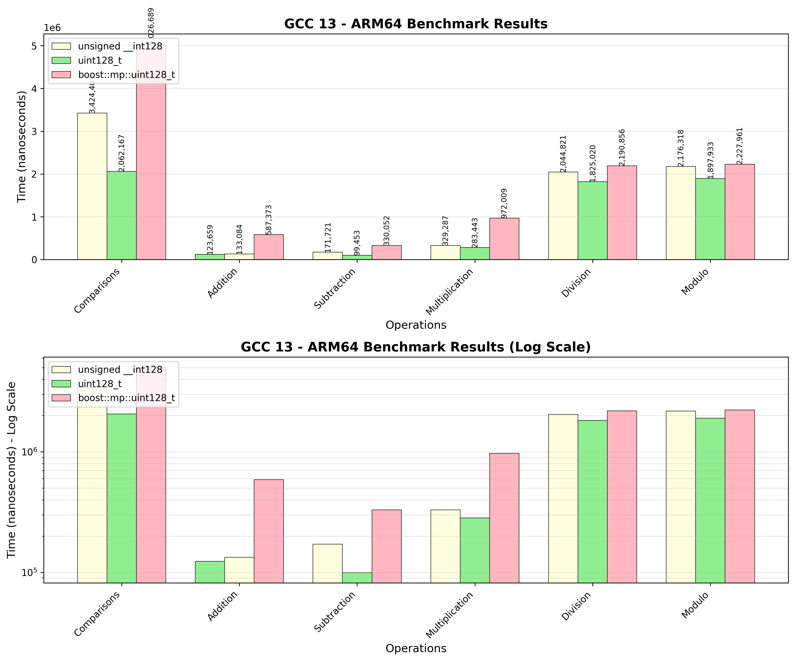
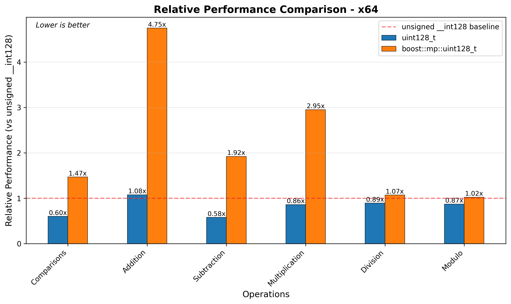

////
Copyright 2025 Matt Borland
Distributed under the Boost Software License, Version 1.0.
https://www.boost.org/LICENSE_1_0.txt
////

[#u128_benchmarks]
= `uint128_t` Benchmarks
:idprefix: u128_benchmarks_

== Linux

=== x86_64

[cols="1,1,1,1"]
|===
| Operation | `std::_Unsigned128` | `uint128_t` | `boost::mp::uint128_t`

| Comparisons | 2068491 | 2416378 | 3191439
| Addition | 383258 | 180522 | 545521
| Subtraction | 208155 | 192633 | 420573
| Multiplication | 291075 | 241174 | 675361
| Division | 3953939 | 4246753 | 4976285
| Modulo | 4042166 | 3953441 | 4478923
|===

////

////

=== x86_32

=== ARM64

[cols="1,1,1,1"]
|===
| Operation | `std::_Unsigned128` | `uint128_t` | `boost::mp::uint128_t`

| Comparisons | 2068491 | 2416378 | 3191439
| Addition | 383258 | 180522 | 545521
| Subtraction | 208155 | 192633 | 420573
| Multiplication | 291075 | 241174 | 675361
| Division | 3953939 | 4246753 | 4976285
| Modulo | 4042166 | 3953441 | 4478923
|===

////

////

=== ARM32

=== S390x

== Windows

=== ARM64

[cols="1,1,1,1"]
|===
| Operation | `std::_Unsigned128` | `uint128_t` | `boost::mp::uint128_t`

| Comparisons | 3424403 | 2062167 | 5026689
| Addition | 123659 | 133084 | 587373
| Subtraction | 171721 | 99453 | 330052
| Multiplication | 329287 | 283443 | 972009
| Division | 2044821 | 1825020 | 2190856
| Modulo | 2176318 | 1897933 | 2227961
|===
////
image::../u128_graphs/windows/arm64_benchmarks.png[ARM64 Benchmark Results, width=100%]
////

image::../u128_graphs/windows/arm64_relative_performance.png[ARM64 Relative Performance, width=100%]

=== x86_32

[cols="1,1,1,1"]
|===
| Operation | `std::_Unsigned128` | `uint128_t` | `boost::mp::uint128_t`

| Comparisons | 4215438 | 3883846 | 2852442
| Addition | 199945 | 208436 | 3242910
| Subtraction | 1206168 | 210874 | 3851129
| Multiplication | 2282869 | 2680359 | 5378001
| Division | 5516964 | 4328917 | 6948267
| Modulo | 4551146 | 4330152 | 6294325
|===
////
image::../u128_graphs/windows/x86_benchmarks.png[x86_32 Benchmark Results, width=100%]
////

image::../u128_graphs/windows/x86_relative_performance.png[x86_32 Relative Performance, width=100%]

=== x86_64

[cols="1,1,1,1"]
|===
| Operation | `std::_Unsigned128` | `uint128_t` | `boost::mp::uint128_t`

| Comparisons | 2060556 | 1921174 | 3009890
| Addition | 261475 | 106545 | 2710279
| Subtraction | 178724 | 124181 | 3059187
| Multiplication | 146063 | 136115 | 3495634
| Division | 1332838 | 1360295 | 4852899
| Modulo | 1465138 | 1471169 | 3926336
|===
////
image::../u128_graphs/windows/x64_benchmarks.png[x64 Benchmark Results, width=100%]
////

image::../u128_graphs/windows/x64_relative_performance.png[x64 Relative Performance, width=100%]

== macOS

=== ARM64 (Apple Silicon)

[cols="1,1,1,1"]
|===
| Operation | `unsigned __in128` | `uint128_t` | `boost::mp::uint128_t`

| Comparisons | 131902 | 133564 | 134182
| Addition | 20613 | 17912 | 40176
| Subtraction | 20484 | 18237 | 40311
| Multiplication | 20160 | 20580 | 43285
| Division | 686521 | 699201 | 945928
| Modulo | 777084 | 724648 | 953117
|===

////
image::../u128_graphs/macos/ARM64_benchmarks.png[ARM64 Benchmark Results, width=100%]
////

image::../u128_graphs/macos/ARM64_relative_performance.png[ARM64 Relative Performance, width=100%]

=== x86_64

[cols="1,1,1,1"]
|===
| Operation | `unsigned __in128` | `uint128_t` | `boost::mp::uint128_t`

| Comparisons | 131902 | 133564 | 134182
| Addition | 20613 | 17912 | 40176
| Subtraction | 20484 | 18237 | 40311
| Multiplication | 20160 | 20580 | 43285
| Division | 686521 | 699201 | 945928
| Modulo | 777084 | 724648 | 953117
|===

////
image::../u128_graphs/macos/x64_benchmarks.png[x64 Benchmark Results, width=100%]
////

image::../u128_graphs/macos/x64_relative_performance.png[x64 Relative Performance, width=100%]
